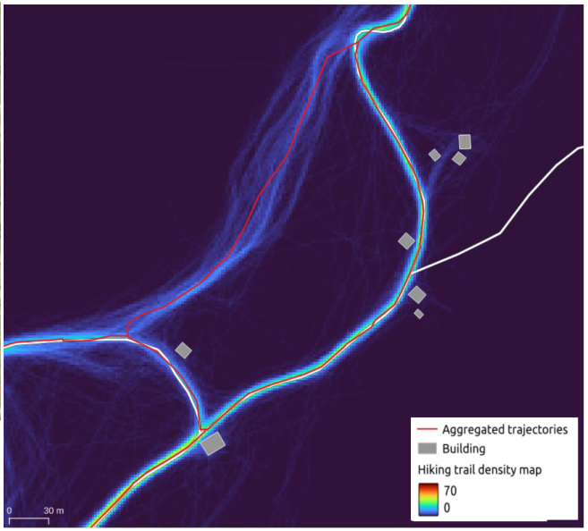

:Author: Marie-Dominique Van Damme
:Version: 1.0
:License: --
:Date: 08/04/2026

Footprint2graph-pipeline’s documentation
=========================================

**Footprint2Graph Pipeline for Outdoor Recreation** (*Footprint2graph-pipeline*) is an open-source Python
processing pipeline (MIT license) for generating outdoor activity footprint graphs
from GNSS trajectories, representing, for example, hikers’ or runners’ footprints within
a defined spatial and temporal extent. The pipeline consists of several components,
including GNSS point map-matching onto a network and trajectory merging,
both implemented using the Tracklib Python library.

A hikers’ footprint (in red) is derived from heatmaps (number of GNSS trajectories),
forming a new topology. This highlights that hikers do not always follow the official trail
network (BDTOPO trails in white). The challenge lies in representing only the paths
effectively used by practitioners.

Table of Contents
------------------

.. toctree::
  :maxdepth: 1
  
  User Guide <user_guide/index>
  End-to-End Examples <examples/index>

History and acknowledgement
-----------------------------

*Footprint2graph-pipeline* was initiated in 2025 as a comprehensive Python framework that builds
upon components previously developed and metrologically analyzed within the *Tracklib* library,
both developed by LASTIG, Univ. Gustave Eiffel, Géodata Paris, IGN. While *Tracklib* focuses
on the manipulation of GNSS trajectories, *Footprint2graph-pipeline* provides a pipeline for
constructing topological networks from GNSS trajectories, which is its primary objective.
  
*Footprint2graph-pipeline* was developed as part of the `IntForOut research Project <https://www.umr-lastig.fr/intforout/>`_ (Multisource spatial data INTegration FOR the Monitoring of Ecosystems under the pressure of OUTdoor recreation)
and was supported by the ANR under grant agreement no. ANR-23-CE55-0003.

*Footprint2graph-pipeline* has been developed by two contributors who are also involved in
maintaining *Tracklib*. It is designed to be used within the IntForOut project (2024-2027)
to generate different graphs for various activities across diverse spatial and temporal scales.

How to Cite Footprint2graph-pipeline
======================================

To be completed

